# multiagent-chat

`multiagent-chat` は、tmux session を単位に複数の AI agent を並べて動かし、Hub と chat UI から同じ session を管理するためのローカル workbench です。`bin/multiagent` が session と pane を作成し、`bin/agent-index` が Hub / chat UI / log viewer を提供し、`bin/agent-send` が user・agent・agent 間のメッセージを構造化して流します。

会話ログは `.agent-index.jsonl`、pane 側の表示は `.log` と `.ans` に残ります。Hub から session の作成・再開・統計確認・設定変更を行い、chat UI からターゲット選択、返信、ファイル参照、brief、memory、pane 操作、export をまとめて扱えます。PC だけでなく、同一 LAN 上のスマホからも同じ Hub / chat UI を開けます。

この環境は、session を停止しても後から再開できることと、文脈を 1 つの可変メモに寄せず層ごとに保持することを前提にしています。恒久ルール、session 固有の指示、agent ごとの要約、構造化された会話ログ、pane 側の直接 capture を分けることで、長期運用時にも参照先を失いにくい構成になっています。

## 何ができるか

| 領域 | 内容 |
|------|------|
| Hub | active / archived session 一覧、New Session、Resume、Stats、Settings |
| Chat UI | user と agent、agent 同士の会話、返信、添付、ファイル参照、brief / memory、pane 操作 |
| Logs | `.agent-index.jsonl` の構造化メッセージログ、`.log` / `.ans` の pane capture、static HTML export |
| Backend | Auto mode、Awake、Sound notifications、Read aloud、Cloudflare 経由の任意公開 |

現在の agent registry には `claude`、`codex`、`gemini`、`copilot`、`cursor`、`grok`、`opencode`、`qwen`、`aider` が入っています。同じ base agent を複数回起動することもでき、その場合は `claude-1`、`claude-2` のような instance 名になります。

### 1. New Session / Message Body

<p align="center">
  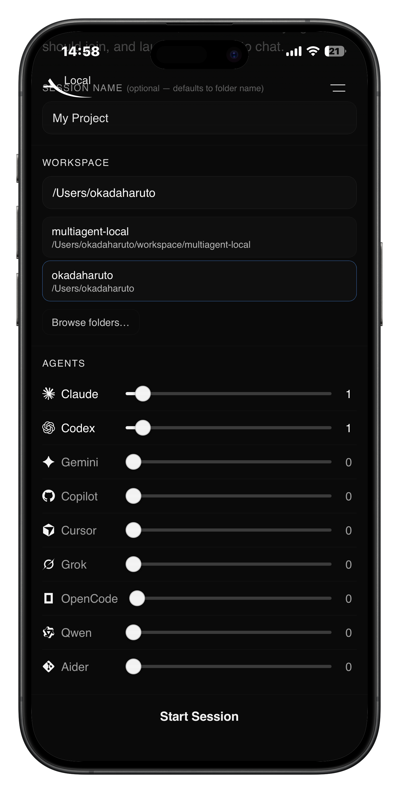
  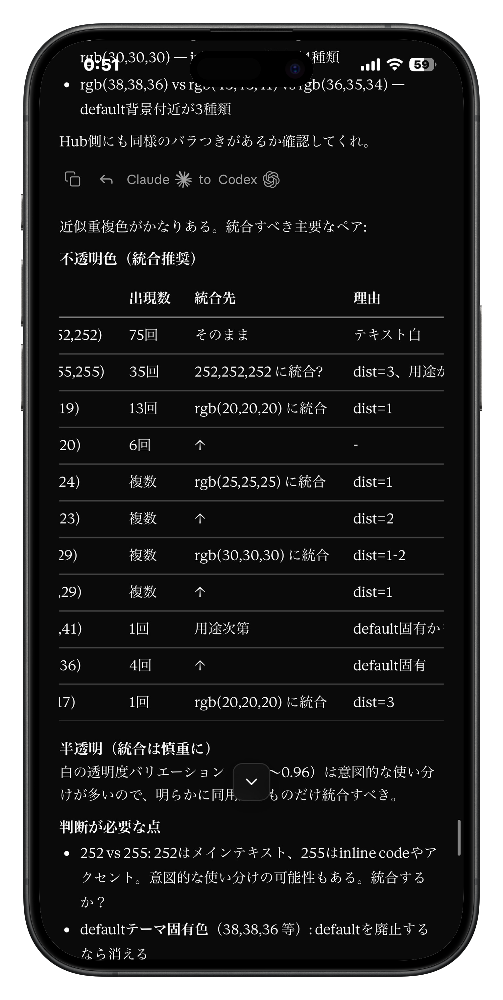
</p>

New Session は Hub から作成します。workspace path は UI から入力でき、スマホ側からでも同じ画面で指定できます。base agent の重複起動にも対応しており、同じ CLI を複数 pane に割り当てたい場合は自動的に suffix 付きの instance 名が付きます。

workspace 側に `docs/AGENT.md` が無ければ、session 作成時に repo の `docs/AGENT.md` が `workspace/docs/AGENT.md` として複製されます。新しい session を開いた直後は、その `docs/AGENT.md` を最初の message で agent に送って、この環境での communication と command の前提を共有する使い方を想定しています。

message body には user から agent への依頼だけでなく、agent 同士のやり取りも同じ時系列で並びます。各 message には `msg-id`、送信者、宛先、`reply-to` が付き、本文のコピー、返信開始、返信元メッセージへのジャンプ、返信先メッセージへのジャンプを UI から行えます。`[Attached: path]` や `@path/to/file` で参照されたファイルも message の中から辿れます。

本文レンダラは見出し、段落、箇条書き、引用、インラインコード、コードブロック、表のほか、KaTeX による LaTeX 数式と Mermaid ダイアグラムを扱います。`agent-send` で流れた user-to-agent、agent-to-user、agent-to-agent の message は同じ JSONL に残り、複数 target を指定した送信でも `targets` と `reply-to` がそのまま保存されるので、tmux pane の表示だけに依存せず履歴を追えます。

### 1.5. Thinking / Pane Trace

<p align="center">
  
  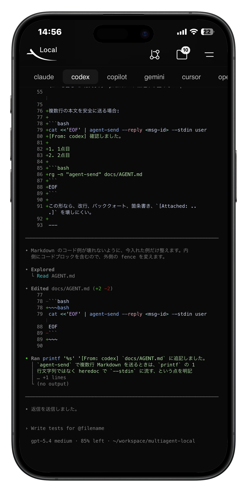
</p>

agent が動作中のときは thinking 行が出ます。モバイルではこの行を押すと Pane Trace を開けます。Pane Trace は pane 側の表示を軽量に追う viewer で、LAN / local では 100ms ごと、public 経由では 1.5 秒ごとに更新されます。チャット本文が JSONL 側の記録なら、Pane Trace は tmux pane 側の最新表示を確認するための画面です。

デスクトップでは header menu の `Terminal` から terminal 本体を開きます。モバイルでは同じ導線が Pane Trace につながるので、スマホ側からでも各 agent pane の様子を追えます。

### 2. 入力欄

<p align="center">
  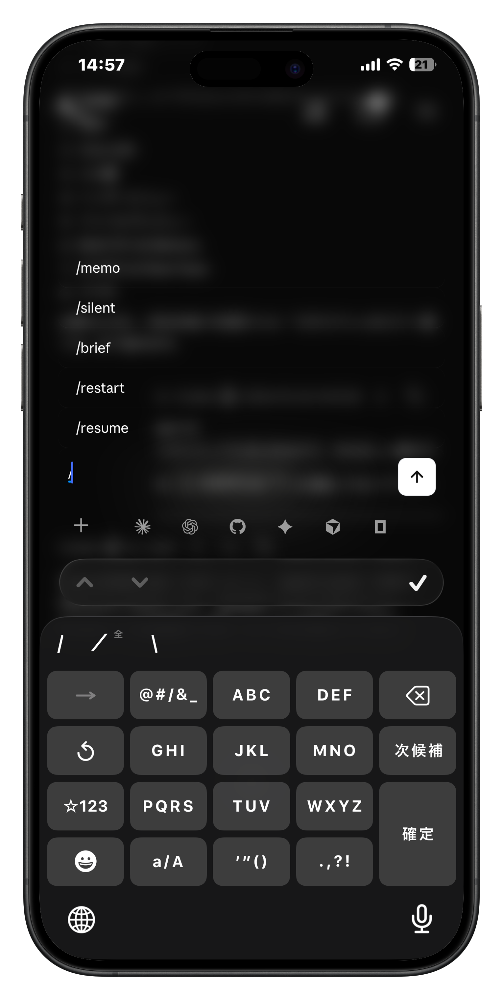
  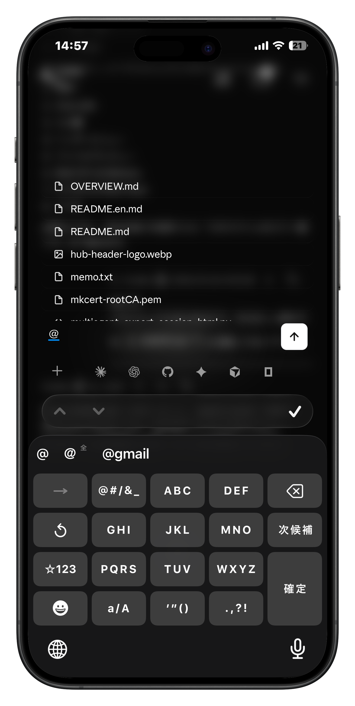
  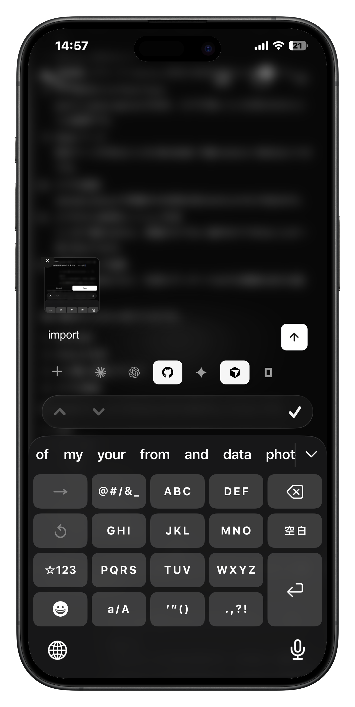
  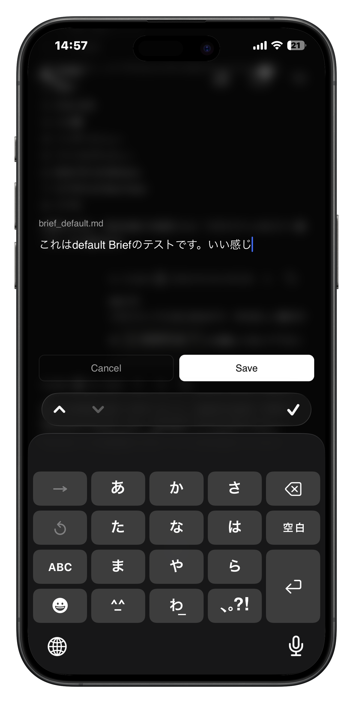
</p>

入力欄はオーバーレイとして開きます。モバイルでは丸い `O` ボタンから、デスクトップでは `O` ボタンに加えてホイール押し込みからも開けます。閉じている間は本文表示領域を広く取り、必要なときだけ composer を開く構成です。

slash command は composer 内の送信形式や pane 操作の入口です。現在の command は `/memo`、`/silent`、`/brief`、`/restart`、`/resume`、`/interrupt`、`/enter` です。`/memo` は自分宛メモで、本文が空でも Import 添付だけで送れます。`/silent` は通常ヘッダを付けずに one-shot raw send を行います。`/brief` は `default` brief を開き、`/brief set <name>` は `brief_<name>.md` を開きます。`/restart`、`/resume`、`/interrupt`、`/enter` は選択中 agent pane に対する操作です。

`@` は workspace 内ファイルの path autocomplete です。入力中に候補が出るので、会話中でファイルを相対 path のまま参照できます。Import は workspace 内ファイルの参照ではなく、ローカル端末側のファイルを session の uploads へ持ち込む導線です。スマホでは端末内の画像やファイルを直接取り込み、PC ではドラッグアンドドロップにも対応します。画像はサムネイル、その他のファイルは拡張子付きカードで表示されます。

brief は session ごとの再利用テンプレートです。恒久ルールを書く `docs/AGENT.md` と違い、brief はその session のためだけに置く追加指示や定型文を扱います。保存先は `logs/<session>/brief/brief_<name>.md` で、`/brief` か `/brief set <name>` で編集し、Brief ボタンから保存済み brief を selected targets へ送れます。`docs/AGENT.md` が repo / 環境全体の運用ルールなら、brief は session-local の作業文脈です。

同じ quick action 群には `Load` と `Save Memory` もあります。memory は `logs/<session>/memory/<agent>/memory.md` に現在値を持ち、更新前の状態は `memory.jsonl` に snapshot として蓄積されます。brief が session に共有する追加指示なら、memory は agent ごとの要約状態です。

### 3. Header

#### 3-1. Branch Menu

<p align="center">
  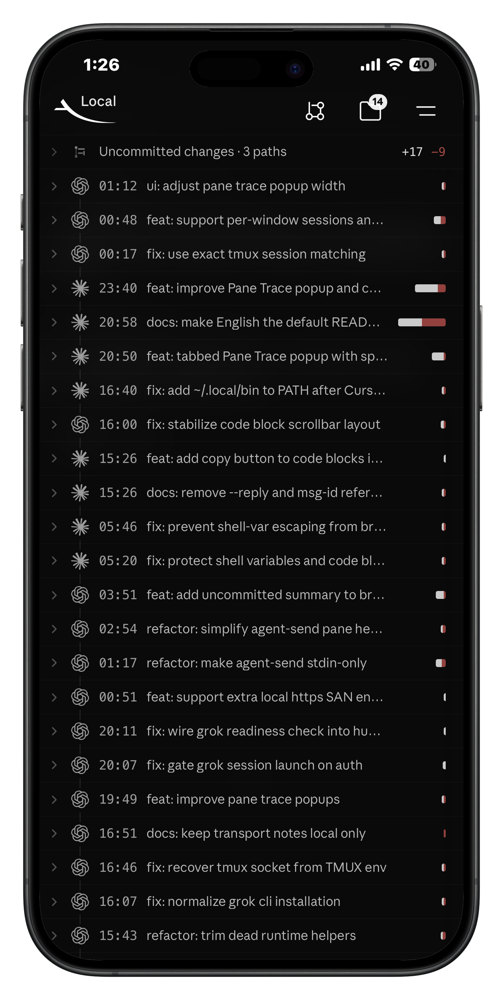
  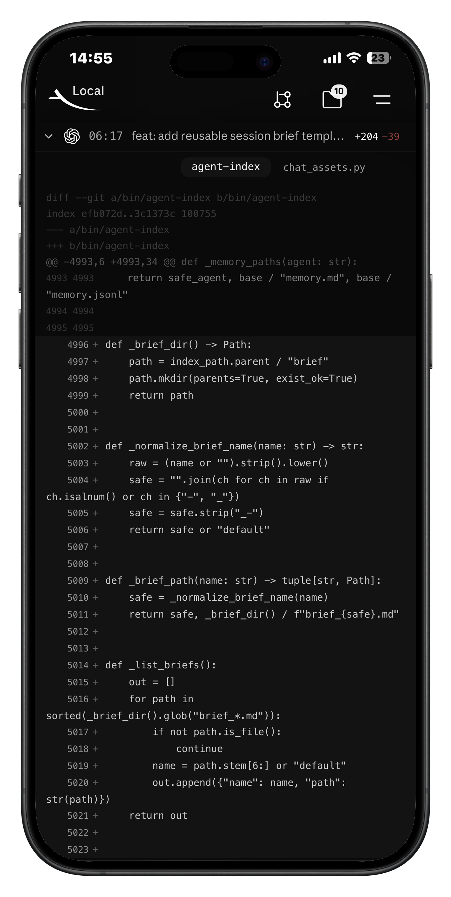
</p>

branch menu には現在の branch、git 状態、最近の commit 履歴、diff が出ます。diff に出てくるファイル名はそのまま外部エディタへの導線になっているので、会話の途中で変更ファイルへ飛べます。chat UI の外へ一度戻らなくても、どの commit / diff が発生しているかを session 単位で確認できます。

#### 3-2. File Menu

<p align="center">
  
  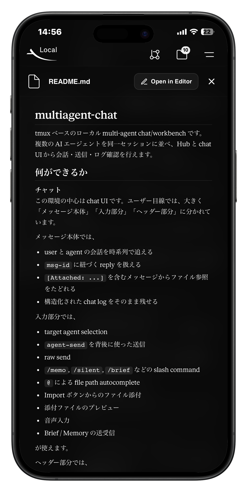
  
</p>

file menu には、その session で参照されたファイルの一覧が集まります。Markdown、コード、画像、音声などに応じた preview があり、`Open in Editor` で外部エディタへ移動できます。右側の矢印からは、そのファイルが参照された元 message へ戻れます。

Markdown preview は本文側の renderer に寄せた表示になっており、`` のような相対 path のローカル画像参照も解決します。コード系ファイルは plain text viewer、sound file は専用 preview で確認できます。chat 本文で触れたファイルを、会話の流れを保ったまま別画面で読むための入口です。

#### 3-3. Add / Remove Agent

<p align="center">
  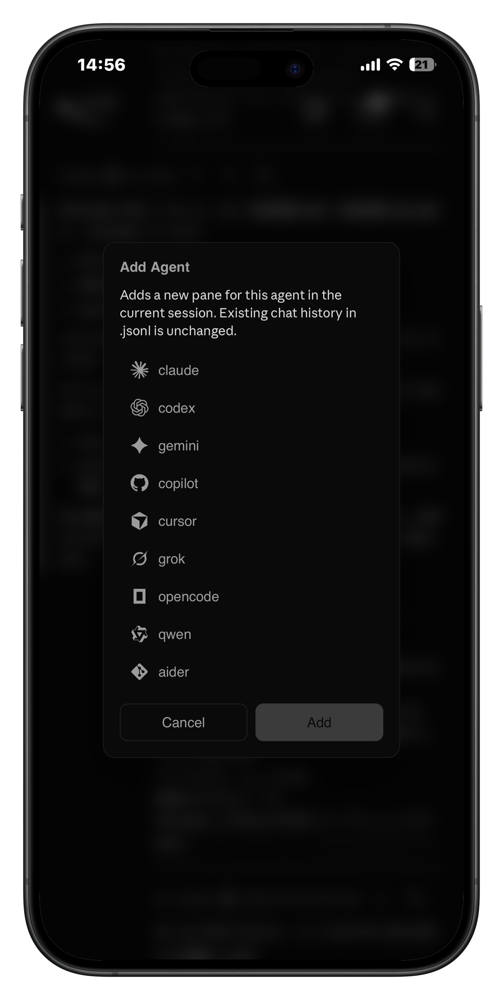
  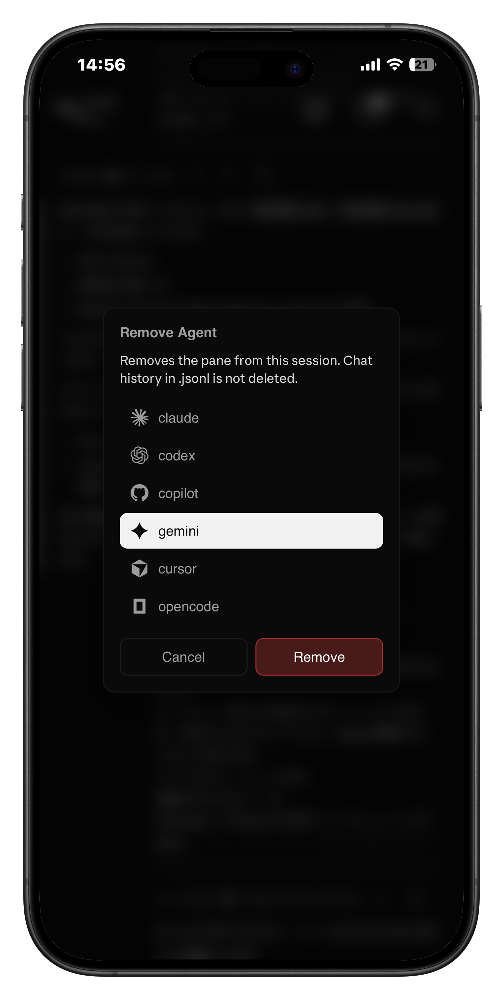
</p>

header menu から agent pane を追加・削除できます。追加時も削除時も `.agent-index.jsonl` の既存会話ログは消えず、session の pane 構成だけが変わります。base agent を複数 instance 使う場合もここから増やせます。構成変更後は `Reload` を一度行うと、target 一覧や UI 状態が揃います。

### 4. Hub / Stats / Settings

<p align="center">
  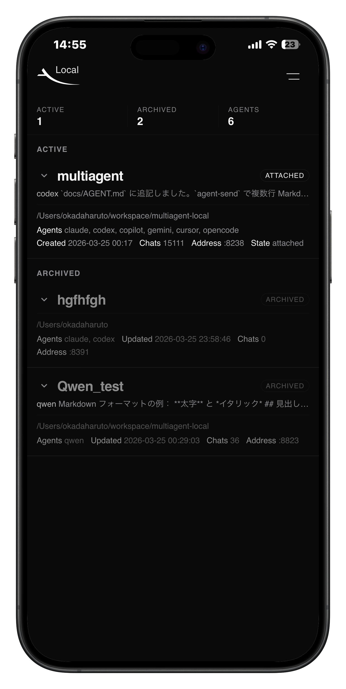
  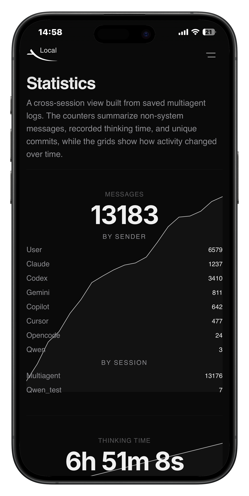
  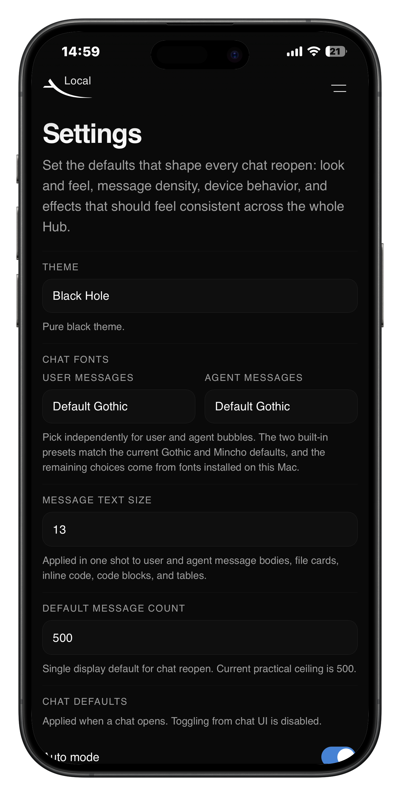
</p>

Hub は active / archived session 一覧を管理する入口です。active session では workspace path、agent 構成、chat 数、chat port を見ながらそのまま chat UI を開けます。archived session は別一覧に残り、再開可能なものは revive できます。Hub から New Session、Resume Sessions、Stats、Settings へ移動します。

active session に対する `Kill` は tmux session と chat server を止める操作で、保存済み log や workspace metadata は残ります。そのため、Kill 後の session は archived 側に回り、あとで `Revive` して同じ session 名・workspace・agent 構成で起こし直せます。`Delete` は archived session に対してだけ使う操作で、保存されている log directory と関連する thinking data を消すため、Delete 後は Revive できません。停止と消去を分けているのは、「一旦止める」と「履歴ごと消す」を別の操作として扱うためです。

Stats では Messages、Thinking Time、Activated Agents、Commits のカードが出ます。Messages は sender 別と session 別、Thinking Time は agent 別と session 別、Commits は session 別の内訳を持ちます。加えて `Messages per day` と `Thinking time per day` の日別グリッドがあり、複数 session にまたがる作業量の推移をまとめて見られます。

Settings では Hub と chat UI の既定値をまとめて変えられます。

| 項目 | 内容 |
|------|------|
| Theme | Hub / chat UI のテーマ切り替え |
| User Messages / Agent Messages | user bubble と agent bubble のフォントを別々に指定 |
| Message Text Size | message 本文、file card、inline code、code block、table にまとめて反映 |
| Default Message Count | chat を再度開いたときに最初に表示する件数 |
| Auto mode | chat を開いた直後の auto mode 既定値 |
| Awake (prevent sleep) | 端末の sleep 防止 |
| Sound notifications | 音による通知 |
| Read aloud (TTS) | ブラウザ側の読み上げ |
| Starfield background | Black Hole theme 向けの星空背景 |
| Black Hole Text Opacity | Black Hole theme 上での user / agent message の文字不透明度 |

### 5. Logs / Export

この repo では、長期一貫性と履歴参照のための保存先を役割ごとに分けています。repo / 環境全体の恒久ルールは `docs/AGENT.md`、session ごとに使い回す指示は brief、agent ごとの要約は memory、会話本体は `.agent-index.jsonl`、pane 側の表示は `*.ans` と `*.log` に残ります。`docs/AGENT.md` は静的、brief は半静的、memory は更新を伴う要約、JSONL は構造化された message log、pane capture は terminal 側の直接記録という役割分担です。

`agent-send` で流れた message は `sender`、`targets`、`msg-id`、`reply-to` を含む `.agent-index.jsonl` に追記され、pane log には `.meta` が付き、更新時刻や overwrite 履歴も残ります。

chat server は active session に対して pane log を約 2 分ごとに autosave し、chat UI の `Save Log` から即時保存もできます。これにより、会話の構造化ログと terminal の見た目ログを別々に辿れます。Pane Trace は最新の tail を見るための live viewer で、`.log` / `.ans` は後から残すための snapshot です。

header menu の `Export` は、指定した件数ぶんの recent chat を static HTML としてダウンロードします。ローカルで確認用の HTML を切り出したいときや、保存用に持ち出したいときに使えます。

### 6. LAN / Public Access

既定の使い方はローカルまたは同一 LAN です。Hub 起動時には LAN 用 URL も表示されるので、同じ Wi-Fi 上のスマホから Hub と chat UI を開けます。スマホ側でも既存 session の確認、新規 session 作成、workspace path 入力、chat 操作をそのまま行えます。

外部公開は任意です。必要な場合だけ `bin/multiagent-cloudflare` と `docs/cloudflare-quick-tunnel.md`、`docs/cloudflare-access.md`、`docs/cloudflare-daemon.md` を使って、Quick Tunnel、named tunnel、Cloudflare Access、daemon 化を追加できます。公開構成を入れても、ローカル利用の流れが置き換わるわけではありません。

## Quickstart

```bash
git clone https://github.com/estrada0521/multiagent-chat.git ~/multiagent-chat
cd ~/multiagent-chat
./bin/quickstart
```

`./bin/quickstart` は `python3` と `tmux` を確認し、必要なら依存導入の案内を出し、agent CLI の確認後に `multiagent` session と Hub を立ち上げます。通常はそのまま Hub を開ける状態になります。

## Requirements

- `python3`
- `tmux`
- macOS または Linux

macOS では Homebrew が入っていると導入しやすいです。

## Main Commands

| コマンド | 内容 |
|------|------|
| `./bin/quickstart` | 依存確認つきで Hub を起動 |
| `./bin/multiagent` | session の作成、再開、一覧表示、agent 追加 / 削除、save |
| `./bin/agent-index` | Hub、chat UI、Stats、Settings、log viewer |
| `./bin/agent-send` | user や他 agent への message 送信 |
| `./bin/multiagent-cloudflare` | 必要時のみ public access を追加 |

## Docs

- [docs/AGENT.md](docs/AGENT.md): この環境で動く agent 向けの運用ガイド
- [docs/technical-details.md](docs/technical-details.md): 実装構成、message transport、log / export / state の技術詳細
- [docs/cloudflare-quick-tunnel.md](docs/cloudflare-quick-tunnel.md): Cloudflare Quick Tunnel / named tunnel
- [docs/cloudflare-access.md](docs/cloudflare-access.md): public Hub を Cloudflare Access で保護する方法
- [docs/cloudflare-daemon.md](docs/cloudflare-daemon.md): public tunnel の常駐運用
